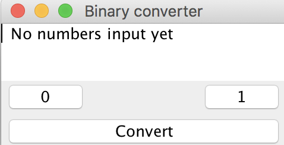
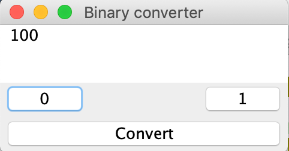
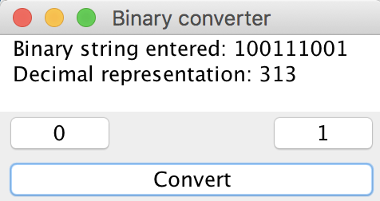

# Graphical User Interface Lab

## Objectives
* Create a simple Java Swing GUI application
* Implement layout design in Java
* Implement action listeners in Java to create an interactive graphical application

## Description
We're going to make a simple binary string converter using Swing.
Decimal numbers, those involving the digits from 0-9, can be represented using a binary form.
Given a binary string such as "1001", your program should calculate the decimal value and output it to a user.

### Sample run
When your application is run, you should present some text indicating that no numbers have been added yet.



The "0" and "1" buttons should append a 0, resp. 1, to the current string.
A user should be able to click several digits.
As a new digit is added to the binary string, the text area should update to show the current binary string.
For example, after clicking 1-0-0, the GUI should look like this:



When the user is done entering bits to the binary string, they should click convert.
The text in the text area after convert should show the binary string along with the "converted" decimal representation, such as this:



### Binary to decimal
* Although Java will handle this for you (Integer class), it's good to understand how the conversion should work so that you can check the correctness of your app.
```
1 0 0 1
| | | |
| | | - 1 * 2^0 = 1 * 1 = 1
| | --- 0 * 2^1 = 0
| ----- 0 * 2^2 = 0
------- 1 * 2^3 = 1 * 8 = 8
___________________________
1 + 0 + 0 + 8 = 9
```

## Submission
Submit the final code via GitHub