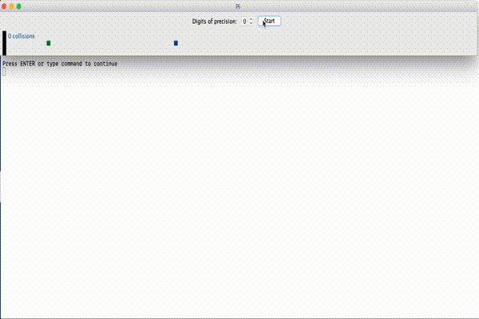

# Project 6 - Calculating Pi

## Outcomes
* Exposure to the basics of timers and parent element control.
* Implement an event driven graphical user application.
* Use cross-disciplinary equations to create a dynamic graphical application.

## Prep Readings:
ZyBooks Chapter on Graphical User Interfaces

## Description
Pi is a really cool number and dessert.
Many people know the first few digits of pi to be 3.1415.
It turns out, based on some geometric properties of circles and lines related to the equations below that it is possible to compute pi by simulating collisions between squares along a line.
The mathematics behind it are clearly beyond the scope of this course, but the key take-away is that sliding a square into another square of the same size wherein an immovable wall lies beyond the stationary square will result in 3 collisions.
1. Block 2 collides with block 1 transferring all of its energy to block 1.
1. Block 1 collides with the wall and bounces right back.
1. Block 1 collides with block 2, transferring all of the energy back into block 2.

Making block 2 much larger than block 1 will require more collisions to turn the second block around.
Specifically, making block 2 10 times as wide and high as block 1 will result in 31 collisions.
Making block 2 100 times as wide and high will result in 314 collisions.

As you may have noticed, by increasing the mass of block 2 we can get a more and more refined estimate of pi.
Note that float-point rounding in Java will become a problem so you will not be able to go to as many digits of pi as you want.
For this project, your system should calculate at least as precise as 3.141.

## Background
### Conservation of Momentum
Like true physicists, we will ignore all of the hard stuff in our calculations for this project.
No energy will be lost to heat, sound or anything else.

In a collision between two objects in an isolated system, the total momentum before the collision is the same as the total momentum afterward.
_So, what is momunetum?_
Momentum is a moving mass, that can be calculated using the basic equation:
> &rho; = m * v

In the case of a collision, the equation before and after must be equal for the sum of the objects in the system, thus
> m1i * v1i + m2i * v2i = m1f * v1f + m2f * v2f

### Elastic Collision
As opposed to a collision where the two objects stick together, such as in a car accident, an elastic collision results in the two objects bouncing off of one another.

In an elastic collision, not only is momentum conserved, but kinetic energy is conserved as well. Thus,
> &frac12;m1i * (v1i)2 + &frac12;m2i * (v2i)2 = &frac12;m1f * (v1f)2 + &frac12;m2f * (v2f)2

Using some algebraic sorcery, we can solve for the final velocities for both objects given the initial velocities.
> v1f = v1i * ((m1 - m2)/(m1 + m2)) + v2i * ((2 * m2)/(m1 + m2))

> v2f = v1i * ((2 * m1)/(m1 + m2)) + v2i * ((m2 - m1)/(m1 + m2))

## Project Requirements
Create a graphical application that displays the sliding blocks as described above.
Somewhere in your GUI, it should be possible to set the level of precision to get, e\.g\. precision 2 would be 3.14 or, in our case 314 collisions.
Somewhere in your GUI it should indicate the number of collisions so far.

## Hints
* Use the Java `Timer` class to update your graphics.
	* `Timer`s emit an event that can be received and handled by any class that implements the `ActionListener` interface.
	* `repaint()` will update your image after updating all of your variables as needed.
* More than one collision can happen in the same `Timer` timestep, so you must count up all of the collisions that would happen.
	* Note that a collision between the two blocks must happen between every two collisions with the wall and vice versa. You'll want to keep track of which type of collision (two blocks, or block #1 with the wall) happened last.
* An elastic collision with an immovable object simply reverses the direction of the velocity vector (since we are dealing with motion along a line that is perpendicular to the wall).
* Allow some small &epsilon; when comparing floating point numbers. Comparing things to 1.0 for example might be problematic, so using 1.0001 or something to that effect might work better for detecting the collision when they are happening really fast.

## Submission Requirements:
* Remember to compile and run your program one last time before you submit it.
	* If your program will not compile, the graders will not be responsible for trying to test it.
		* By this point in the semester you are an intermediate software developer and code that is submitted that will not compile or run will get a zero.
		* Turning in partial work that runs will get you partial credit; 99% complete code that doesn't run is no credit, you make the call.
* All .java files (this should include unit tests, if any, you created).
 
## Important Notes:
1. Projects will be graded on whether they correctly solve the problem, and whether they adhere to good programming practices.
1. Projects must be submitted by the time specified on the due date.
Projects submitted after that time will get a grade of zero.
1. Please review UWF's academic conduct policy.
Note that viewing another student's solution, whether in whole or in part, is considered academic dishonesty.
Also note that submitting code obtained through the Internet or other sources, whether in whole or in part, is considered academic dishonesty.
All programs submitted will be reviewed for evidence of academic dishonesty, and all violations will be handled accordingly.